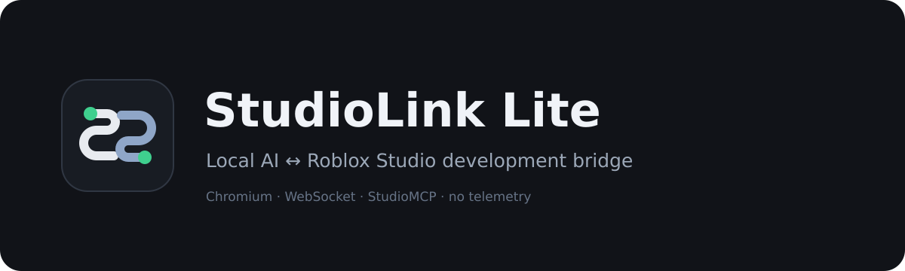

# StudioLink Lite



StudioLink Lite is a lightweight local bridge that lets a supported AI website operate an open Roblox Studio place through Roblox Studio's StudioMCP server. The normal workflow uses the AI website's existing browser session, so it does not require an API key.

## Architecture

```text
AI website
  ↕ provider DOM adapter
StudioLink Lite Chromium extension
  ↕ ws://127.0.0.1:17613
StudioLink Lite Python bridge
  ↕ JSON-RPC over local stdio
Roblox Studio StudioMCP
  ↕
Roblox Studio
```

The bridge binds only to `127.0.0.1`. It accepts the small StudioLink protocol only from Chromium extension origins, validates tool names, arguments, IDs and timeouts, and does not accept shell commands or MCP process configuration from webpages. Local configuration is restricted to the bundled Roblox Studio launcher; extra processes and replacement commands are ignored. There is no analytics, telemetry, advertising or cloud relay.

## Supported browser providers

- ChatGPT
- Hy4 through Tencent WorkBuddy
- DeepSeek
- Gemini
- Kimi
- GLM / Z.ai
- Qwen
- Arena in Direct mode
- Meta AI

Each browser integration is isolated behind the same provider interface. Command parsing, execution and StudioMCP communication are independent of the website adapter, so a future direct Hy4 API provider can be added without changing the Roblox/MCP core.

## Requirements

- Windows 10 or Windows 11
- Chrome, Edge, Brave or another Chromium browser with Manifest V3 support
- Python 3.9 or newer
- Roblox Studio with a place open
- Roblox Studio's **Studio as MCP server** option enabled

macOS and Linux launch support inherited from the upstream project remains included, but Windows is the primary target.

## Install the unpacked extension

1. Download or clone the complete project and extract it if needed.
2. Open `chrome://extensions` in Chrome/Brave, or `edge://extensions` in Edge.
3. Enable **Developer mode**.
4. Click **Load unpacked**.
5. Select the `studiolink-lite-extension` folder.
6. Pin **StudioLink Lite** to the browser toolbar if desired.

After updating the project files, click **Reload** on the extension card and reload any already-open AI tabs.

### ChatGPT compatibility (extension 1.6.3)

Version 1.6.3 keeps the 1.6.2 composer-layout fix and additionally handles React replacing the editor during a large injection. It accepts the replacement only after comparing the complete logical message in the same composer; partial input is still rejected. To verify geometry locally, open `tests/chatgpt-layout.html` through the local HTTP server described below.

Use a signed-in ChatGPT session in the full chat interface and start a new, empty chat. The lightweight interface observed on the signed-out page submits a form with full-page navigation; that flow is not supported by the in-page agent. The extension now detects it and explains why startup is unavailable. Signing in is a prerequisite, not a guarantee that every ChatGPT UI variant is supported.

Version 1.6.1 fixes long-reasoning detection, input verification, incomplete startup state and stale CodeMirror snapshots. It does not add permissions or change the Python bridge (still version 1.6.0). After replacing an unpacked extension folder, keep only one copy enabled and reload both the extension and ChatGPT tab.

Focused checks: `node --test tests/test_chatgpt_startup.js`, `node studiolink-lite-extension/test-chatgpt.js`, and `node studiolink-lite-extension/test-core-main.js`. For native browser editing tests, serve the repository locally (`py -3 -m http.server 18761 --bind 127.0.0.1`), open `http://127.0.0.1:18761/tests/chatgpt-dom.html`, and click **Run tests**. These fixtures do not contact ChatGPT or Roblox and are not a substitute for a signed-in end-to-end test.

## Start the local bridge

### Windows

Double-click `start.bat`. On the first run it finds or installs Python and installs the single `websockets` dependency. Keep the terminal window open while using StudioLink Lite.

Manual start:

```powershell
py -3 -m pip install --user websockets
py -3 bridge.py
```

The default endpoint is `ws://127.0.0.1:17613`. The packaged extension expects this port. Advanced local diagnostics can override the bridge with `SLL_BRIDGE_PORT`, but the matching `PORT` constant in `studiolink-lite-extension/background.js` must then be changed and the unpacked extension reloaded.

### macOS / Linux

Run `MacOS_Start.command`, or run:

```bash
python3 -m pip install --user websockets
python3 bridge.py
```

## Connect Roblox Studio

1. Open Roblox Studio and load the place you want to edit.
2. Open **Assistant Settings**.
3. Open **MCP Servers**.
4. Enable **Studio as MCP server**.
5. Start `start.bat` if it is not already running.
6. Open the extension popup. **Bridge** and **Roblox Studio** should both show **Connected**.

The bridge automatically discovers the newest valid `StudioMCP.exe`, starts it, retrieves its command catalogue and recovers after normal StudioMCP or Roblox Studio restarts. If discovery is not possible, set `SLL_STUDIO_MCP_PATH` to the executable or its containing directory.

## Use ChatGPT

1. Open [ChatGPT](https://chatgpt.com/) and create a new, empty conversation.
2. Wait for the StudioLink Lite bar to appear above the composer.
3. Click **Start Roblox agent** in the page, or choose **ChatGPT** and click **Start Session** in the extension popup.
4. Wait for the startup turn to finish.
5. Describe the work you want done in Roblox Studio.
6. Use **Stop** while the agent is generating or executing if you need to cancel the current run.

StudioLink Lite recognizes command blocks in assistant responses, sends one validated call at a time to StudioMCP, injects the result into the same conversation and lets the AI continue. Refreshing the page restores session detection for the same conversation.

## Use Hy4

1. Open [Tencent WorkBuddy](https://www.workbuddy.ai/app) and sign in if requested.
2. Select Hy4 in WorkBuddy's model controls when the option is available for your account.
3. Start a new, empty WorkBuddy conversation.
4. Choose **Hy4 (WorkBuddy)** in the StudioLink Lite popup and click **Start Session**, or use the in-page bar.
5. Describe the Roblox Studio task normally.

Tencent's official [Hy4 Preview page](https://hy.tencent.ai/research/hy4-preview) lists WorkBuddy among the ways to access the model rather than providing a dedicated public Hy4 chat page. WorkBuddy may route models automatically depending on account, region and plan; StudioLink Lite cannot force a hidden model selection. The composer and send controls were verified against the current WorkBuddy interface, while authenticated Hy4 model routing cannot be tested automatically without a user's WorkBuddy account.

## Status and recovery

The popup reports three independent states:

- **Bridge** — the Manifest V3 service worker's localhost WebSocket state
- **Roblox Studio** — StudioMCP process and usable Studio place state
- **Agent** — idle, active or currently working

The service worker reconnects automatically with bounded backoff and heartbeat-based stale-socket detection. StudioMCP is monitored and restarted when realistic crash/restart conditions are detected. A page reload or SPA conversation change is detected without executing historical commands again.

Common recovery steps:

- **Bridge disconnected:** reopen `start.bat`; the extension reconnects automatically.
- **Studio open but disconnected:** open Roblox Studio's **Assistant Settings → MCP Servers**, then toggle **Studio as MCP server** off and on.
- **No place loaded:** open a place in Roblox Studio.
- **Extension updated while a chat is open:** reload that AI page.
- **WorkBuddy input unavailable:** sign in, return to `/app`, and start a fresh chat.

Logs are written to `logs/bridge_debug.log` and `logs/start.log`.

## Project layout

```text
studiolink-lite-extension/   Manifest V3 extension and provider adapters
  background.js              localhost WebSocket owner and reconnect logic
  core/config.js             protocol prompt and shared configuration
  core/parser.js             pure command parser
  core/main.js               provider-independent agent loop and session UI
  providers/                 browser DOM adapters, including hy4.js
bridge.py                    validated WebSocket ↔ MCP JSON-RPC bridge
launch_studio_mcp.py         current StudioMCP discovery and launcher
config.json                  local StudioMCP process definition
start.bat                    Windows launcher
```

Some internal `ZS`, `zs-*` marker, DOM and storage identifiers are intentionally retained for compatibility with existing conversations and persisted session state. They are implementation details and are not user-facing branding.

## Testing

Run the repository checks with:

```powershell
py -3 -m unittest discover -s tests -v
node studiolink-lite-extension/test-parser.js
node studiolink-lite-extension/test-chatgpt.js
node studiolink-lite-extension/test-hy4.js
node studiolink-lite-extension/test-core-main.js
```

The automated suite validates syntax, manifest structure, provider contracts, parser behavior, security validation and a local mock MCP round trip. A final real-device pass still requires Windows, an installed Roblox Studio, an open place and the user's authenticated provider sessions.

## License and attribution

StudioLink Lite is a modified fork of [ZeroScript-Free](https://github.com/sebattfg/ZeroScript-Free) by sebattfg. The fork preserves the upstream GPL-3.0-or-later license and copyright requirements. See [LICENSE](LICENSE), [NOTICE.md](NOTICE.md) and [UPSTREAM_CHANGELOG.md](UPSTREAM_CHANGELOG.md).
